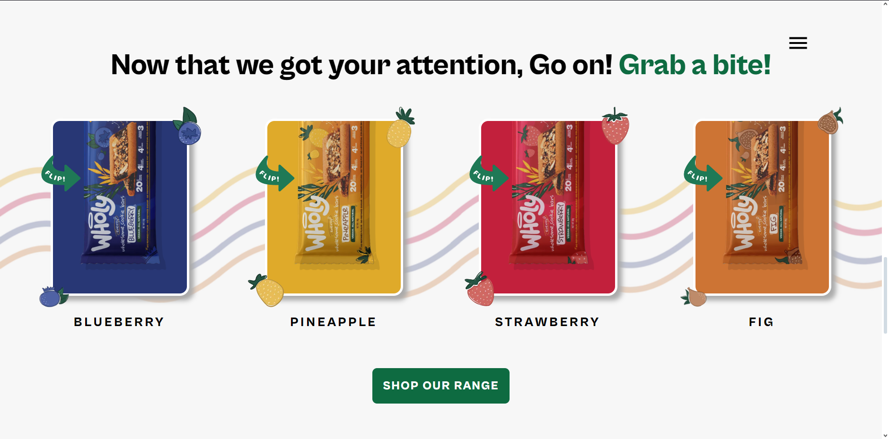
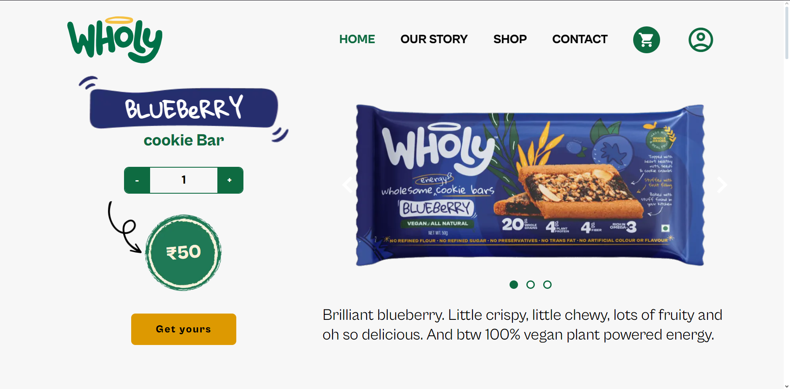
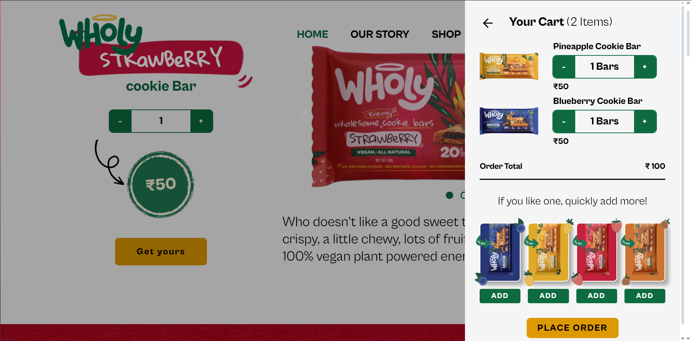

# 🛒 EatWholy eCommerce Website


<br />


Preview website using a **Live Url**: [https://wholy-website.vercel.app](https://wholy-website.vercel.app)

**Previous version** of this project can be found in this repository: [Legacy GitHub project](https://github.com/YaminNather/wholy-website)

An online storefront that provides you the convience of purchasing delicious handcrafted cookies infused with the irresistible flavors of blueberry, pineapple, strawberry, and fig right from the comfort of your home.

## Table of Contents
- [Features](#features)
- [Technology Stack](#technology-stack)
- [Installation](installation)
- [Screenshots](screenshots)

## 🛠️ Technology Stack
- Website built using **NextJS, Typescript and SCSS** for the frontend.
- Admin Dashboard and Backend built using **NodeJS** and **MedusaJS**.
- Integrated Authentication using **Firebase Authentication**.
- **Stripe** was used as the Payment Processor.
- **PostgreSQL** was used as the Database.

## ✨ Features
- Fully responsive on Mobile and Desktop.
- Cart functionality without the need to be signed in.
- Authentication via Firebase Authentication.
- Various Payment Options through Stripe.
- Ordering functionality with tracking using Shiprocket.
- Admin Dashboard through Medusa JS.

## 📸 Screenshots









## Installation
- Open your preferred terminal and navigate to the directory where you want to create the PostgreSQL database. Run the following command to create the database.

```sh
cd "<<DATABASE DIRECTORY>>"
initdb --encoding="utf8" --pgdata="." 
```

- Clone the project to your device using

```sh
git clone https://github.com/YaminNather/wholy-ecommerce.git
```

- Navigate into the project.
```sh
cd "<<project_directory>>"
```

- Copy the .env.local.template file 
```sh
cp "./.env.local.template" ".env"
```

Set the required Environment Variables in the .env file needed to interact with the other services.

OR

Set Environment Variables directly in your Operating System.

- Start the Docker containers via Docker Compose using

```sh
docker-compose -f="./docker-compose.yml" up
```

The ports can be found in the docker-compose.yml file.